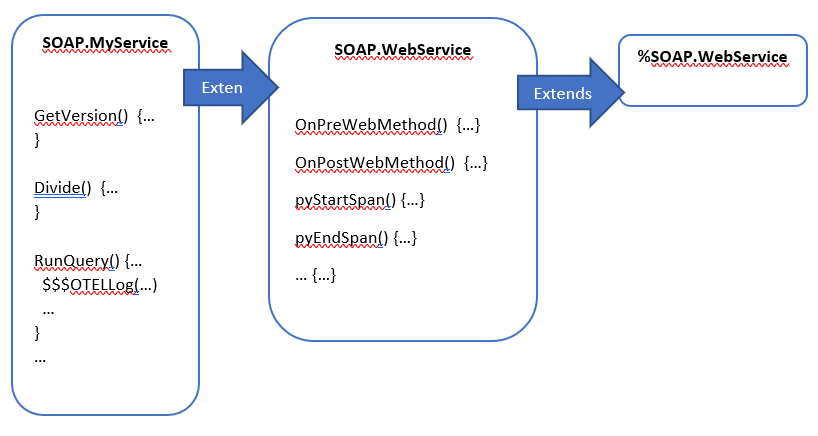

# OpenTelemetry Traceing for IRIS SOAP Services

## Overview
A customer recently asked if IRIS supported OpenTelemetry and it could produce information on how long InterSystems IRIS (IRIS) implemented SOAP Services take to complete.  Up until and including versions 2023.3, IRIS does not natively support OpenTelemetry.  

It's fair to say that IRIS data platform has several ways to capture, log and analyse the performance of a running instance, this information does not flow out of IRIS through to other opentelemetry components like Agents or Collectors within an implemented OpenTelemetry-supported stack.  Several technologies already support OpenTelemetry and it is fast becoming an adopted standard in the world of Observability.

Whilst there is ongoing development to natively support this observability standard in future IRIS releases, this article explains how, with the help of the Embedded Python and the corresponding Python libraries, IRIS application developers can start publishing Trace events to your OpenTelemetry back-ends with minimal effort.  More importantly, this gives my customer somethign to get up and running with today. 

## Observability. 
Observability generally comprises of three main aspects:

## 
* Metrics capture, which is the capture of quantitative measuremements about the performance and behaviour of a system, similar to what IRIS publishes via its /api/monitor/metrics api
* Logging, which involves capturing and storing relevant information generated by an application or system, such as what appears in System Log outputs, or messages.log file generated by IRIS instances.
* Tracing: which involves tracking the flow of a service request or transaction as it moves through various components of a solution. Distributed tracing allows you to follow the path of a request across multiple services, providing a visual representation of the entire transaction flow.
  
This application focuses solely on Tracing of SOAP Services.

## Approach for implementation:
Extend IRIS's %SOAP.WebService class with OpenTelemetry implementation logic and Python library functions. Include Macros that can be used in user code to further contribute to observability and tracing. Minimal changes to the existing SOAP implementation should be needed (replace use of %SOAP.WebService to SOAP.WebService as the Web Services implementation class).  The Diagram below illustrates this approach:




## Features:

* By default, every SOAP Service will be tracked and reports trace information.
* When a SOAP Service is used for the first time, the implementation will initalise an OpenTelemetry Tracer object. A combination of the IRIS Server name and Instance is provided as the telemetry source, and, the SOAP Action used as th name for the default root span tracking the soap service.
* Telemetry traces and the default span will be automatically closed when the SOAP method call ends
* Upon creation, Key/Value pairs of attributes can be added to the default root span, such as, CSP Session ID, or Job number
* Users may use the $$$OTELLog(...), to add an arbitratry manual logging into a span, using a simple string or array of key valye pairs 
* Users may use the $$$OTELPushChildSpan(...)/$$$OTELPopChildSpan(...) to create non-root spans around sections of code which they want to independantly identify with their logic 


# Installation and testing
Clone/git pull the repo into any local directory

```
$ git clone https://github.com/intersystems-community/OpenTelemetry-Trace-SOAP.git
```
Open a terminal window in this directory and type the following to build the IRIS images with sample code:

```
$ docker-compose build
```
Once the iris image is build, in the same directory type the following to start up the Jaeger and IRIS containers:

```
$ docker-compose up -d
```

This will startup two containers - the Jaeger OpenTelemetry target backend container (also exposing a user interface), and, an instance of IRIS which will serve as the SOAP Web Services server endpoint.  Three simple webservices have been developed in the IRIS instance for testing the solution.

The IRIS instance hosts three simple SOAP Services:

* GetIRISVersion():
    - Return the $ZV value of the IRIS instance
    - Other than the default functionality, no additonal observations are made
* Divide(a, b): 
    - This method takes two integers and returns the value of their division. It arbitrarily starts a child span, and within that a second nested span before completion,
    - Demonstrates using $$$OTELPushChildSpan(..) macro, in a method with multiple nested span levels. These spans are visible as nested spand in the Jaeger UI
    - Uses $$$OTELLog(..) with arbitrary logs to add detail to the current span
* RunQuery() 
    - This method runs a query to count classes
    - Demos starting an independant span tracking query prepration, and execution
    - Using $$$OTELPushChildSpan(..) macros available, the method identifies these operations a independant, non-nested logic blocks
    - These spans are visible as siblings in the Jaeger UI
    - Using $$$OTELLog(..) arbitrary logs to add further detail

The Web service functionality is trivial and largely irrelevant, but serves to show telemetry tracing in action. 

## How to Test and view the results.
Generating trace information for the SOAP Web Methods can be done by building SOAP client (using your favourite technology) and then calling these services, just as any user or application would do in a real-world application. 

However - In order to simplify this process, and purely for demonstration purposes, we will leverage IRIS's helper CSP pages that allows us to call these SOAP methods from a browser:

Using your browser access the SOAP Information and testing pages via this URL. logging in as superuser/SYS if prompted:

```
http://localhost:52773/csp/irisapp/SOAP.MyService.cls
```

(Note: These pages are not enabled by default and security within the running IRIS instance had to be relaxed to enable this feature, for ease of testing)


Select each of the web methods you want to test, in order to generate SOAP activity.  To see this implementation generate traces with a Status of 'Error'. use zero (0) as the second number in the Divide() SOAP method in order to force a <DIVDE> error.

Open another browser tab pull up the Jaeger UI via the following URL
```
http://localhost:16686
```
The resulting landing page shows you all services contributing telemetry readings and should look something similar to the screenshot below:


